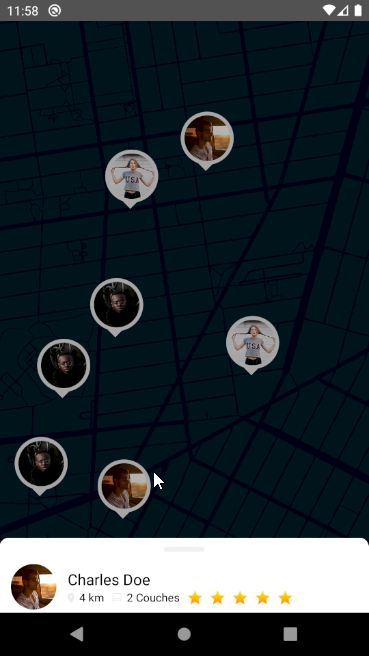
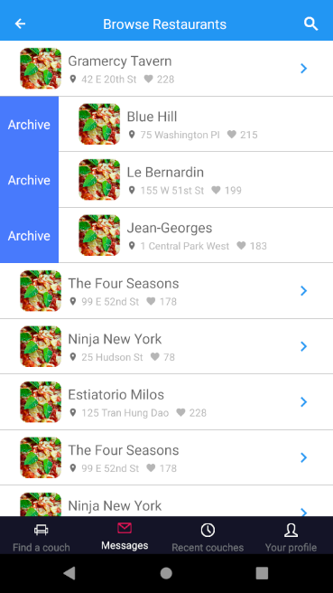
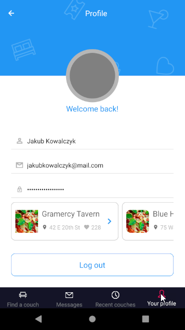

# RN_Restaurant_App

version https://git-lfs.github.com/spec/v1
oid sha256:f6883bdbae50b60cff3cfec1432cdd1d11bfac48e51a97cf0e16f5cab8c7a7f3
size 257

[
[
[
[
[
[

[release app android](realase_app/restaurant_screens.apk)

Example: giao diện của app giới thiệu về nhà hà ng khi thực hà nh app, sử dụng mấy gói actions sheet tab view ...
